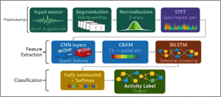
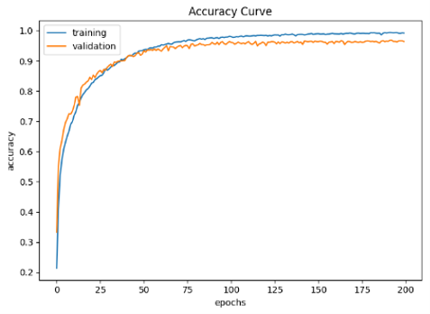
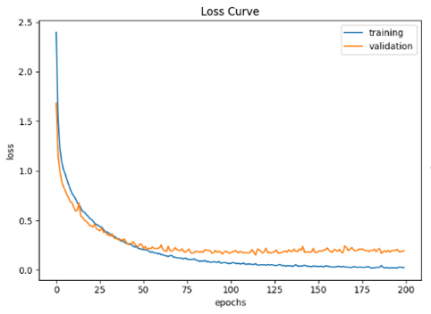
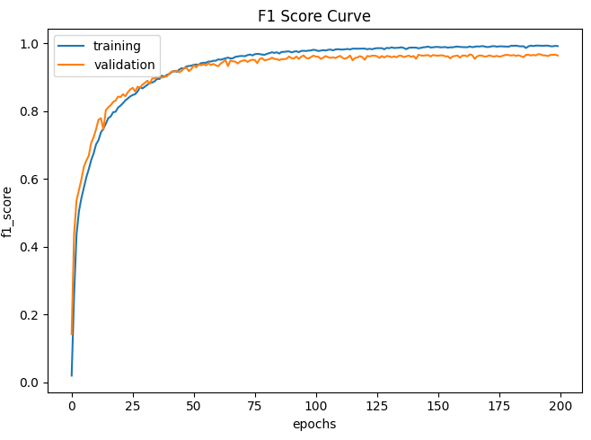
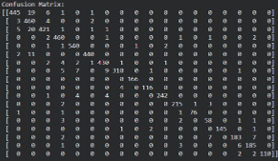

# Human Activity Recognition using Hybrid CNN-CBAM-BiLSTM Deep Learning Framework

A deep learning framework for **Human Activity Recognition (HAR)** that combines **Convolutional Neural Networks (CNN)**, the **Convolutional Block Attention Module (CBAM)**, and **Bidirectional Long Short-Term Memory (BiLSTM)** networks to classify human activities using wearable sensor data.

---

## Overview

Human Activity Recognition (HAR) is the task of automatically identifying human activities using data collected from wearable sensors such as accelerometers and gyroscopes.

This project presents a hybrid deep learning framework that integrates:

- **CNN** for spatial feature extraction
- **CBAM** for channel and spatial attention
- **BiLSTM** for temporal sequence learning

The proposed architecture was evaluated on two benchmark datasets:

- KU-HAR
- UCI-HAR

---

## Key Features

- Hybrid CNN + CBAM + BiLSTM architecture
- Attention-based feature extraction using CBAM
- Temporal sequence modeling using BiLSTM
- Evaluated on KU-HAR and UCI-HAR datasets
- Performance evaluated using Accuracy, Precision, Recall, F1-Score, and Confusion Matrix
- Implemented using TensorFlow and Keras

---

## Motivation

Traditional CNN models are effective at extracting spatial features but have limited capability in learning long-term temporal dependencies from sequential sensor data.

To address this limitation, this project extends a CNN-CBAM architecture by incorporating **BiLSTM**, enabling the model to learn both spatial and temporal representations for improved Human Activity Recognition.

---

# Model Architecture

<p align="center">

</p>

The proposed framework follows the pipeline below:

```
Input Sensor Data
        │
        ▼
CNN Feature Extraction
        │
        ▼
CBAM Attention Module
        │
        ▼
Residual Feature Learning
        │
        ▼
BiLSTM
        │
        ▼
Fully Connected Layers
        │
        ▼
Softmax Classification
```

---

# Datasets

## KU-HAR

- Smartphone sensor dataset
- 18 activity classes
- Accelerometer and gyroscope signals

## UCI-HAR

- Public benchmark Human Activity Recognition dataset
- 6 activity classes
- Accelerometer and gyroscope signals

---

# Technologies Used

- Python
- TensorFlow
- Keras
- NumPy
- Pandas
- Matplotlib
- Scikit-learn
- hdf5storage

---

# Experimental Results

The proposed CNN-CBAM-BiLSTM model was evaluated on two benchmark Human Activity Recognition datasets.

## Overall Performance

| Dataset | Model | Test Accuracy |
|----------|-------|--------------:|
| KU-HAR | CNN + CBAM + BiLSTM | **96.41%** |
| UCI-HAR | CNN + CBAM + BiLSTM | **94.41%** |

The proposed hybrid architecture achieved **96.41% test accuracy on the KU-HAR dataset** and **94.41% on the UCI-HAR dataset**, demonstrating its effectiveness in learning both spatial and temporal features from wearable sensor data.

---

## KU-HAR Performance Metrics

| Metric | Value |
|---------|------:|
| Test Accuracy | **96.41%** |
| Precision | **0.9691** |
| Recall | **0.9653** |
| F1-Score | **0.9672** |

---

# Training and Validation Accuracy

<p align="center">

</p>

---

# Training and Validation Loss

<p align="center">

</p>

---

# Training and Validation F1-Score

<p align="center">

</p>

---

# Confusion Matrix

<p align="center">

</p>

---

# Repository Structure

```
Human-Activity-Recognition-CNN-CBAM-BiLSTM
│
├── images/
│   ├── Architecture.png
│   ├── Accuracy.png
│   ├── loss.png
│   ├── f1_score.png
│   └── confusion_matrix.png
│
├── dataset/
│
├── results/
│
├── HAR_CNN_CBAM_BiLSTM.ipynb
├── HAR_CNN_CBAM_BiLSTM_Updated.py
├── README.md
├── requirements.txt
├── .gitignore
└── LICENSE
```

---

# Installation

Clone the repository:

```bash
git clone https://github.com/MangaiS20/Human-Activity-Recognition-CNN-CBAM-BiLSTM.git
```

Move to the project folder:

```bash
cd Human-Activity-Recognition-CNN-CBAM-BiLSTM
```

Install the required packages:

```bash
pip install -r requirements.txt
```

---

# Usage

Run the Jupyter Notebook:

```
HAR_CNN_CBAM_BiLSTM.ipynb
```

or execute the Python implementation after configuring the dataset paths.

---

# Future Improvements

- Evaluate on additional HAR datasets
- Hyperparameter optimization
- Model compression for edge devices
- Real-time Human Activity Recognition
- Explainable AI (XAI) analysis
- Deployment as a lightweight inference model

---

# References

1. Woo S., Park J., Lee J. Y., Kweon I. S.
   **CBAM: Convolutional Block Attention Module.**

2. Human Activity Recognition Using Attention-Mechanism-Based Deep Learning Feature Combination.

---

# Author

**Mangai S**

**M.Sc. Data Science**

**Python | SQL | Machine Learning | Data Analytics**

📧 Email: **mangaiofficial20@gmail.com**

💼 LinkedIn: **https://www.linkedin.com/in/mangais20**

---

⭐ If you find this project useful, consider giving it a star.
